# Architecture

## Components

- `src/ui`: source selection, editable before/after cards, explicit approval, activity and setup.
- `src/core/controller.ts`: durable queue orchestration. State is persisted before any GitHub write. Each item retains its settings, pinned snapshot and stable UUID.
- `src/core/types.ts`: strict local-model contract and lifecycle types.
- `src/core/ics.ts`: the bridge’s restricted ordinary timed-event ICS format, text escaping, UTF-8 folding and stable SHA-256 identities.
- `src/adapters`: Beeper REST, Ollama structured JSON, GitHub calendar workflow, native transport and deterministic demo fixtures.
- `src-tauri`: window, tray, shortcut, explicit clipboard access, atomic local storage, fixed credential commands, OAuth PKCE and constrained HTTP transport.

The Tauri process contains all secrets and native networking. The frontend receives service JSON, not access tokens. No Node sidecar or manually managed app server is required in the packaged app.

## Proposal protocol

```mermaid
stateDiagram-v2
    [*] --> review: Explicit capture and local inference
    review --> submitting: Open review; persist stable intent
    submitting --> pull_request: PR created or recovered
    pull_request --> merging: User approves exact change
    merging --> awaiting_calendar: GitHub confirms merge
    pull_request --> closed: PR closed without merge
    awaiting_calendar --> confirmed: Matching receipt and refreshed snapshot
```

A pending submission keeps its UUID, branch, source commit, ICS path and bytes across retries. If a PR response is lost, the app queries the same branch before creating a new review. It never regenerates a new event identity during retry.

New event identity matches `gcal-git-bridge/contrib/github/ics.py`:

- UID: UUIDv4 followed by `@gcal-git-bridge`.
- Operation: `ics-create-` + SHA-256(calendar ID + NUL + UID).
- Google ID: `b` + SHA-256(calendar ID + NUL + operation ID).
- Path: `events/<sha256-calendar>/<sha256-event>.ics`.

For an update, the original exported ICS fixed fields are retained. The receipt operation ID is `ics-` + SHA-256(first-parent merge commit + NUL + ICS path), matching the bridge’s `ics_sync.py` traversal. The app uses squash merge so one approved proposal maps to one first-parent change.

The receipt schema is `{digest, status, eventId}`; the operation identity comes from its filename. Confirmation also reads the generated event snapshot at the same current repository commit and compares title, description, location, start and end.

## Bounded inference

Manual search uses up to 18 literal words and asks Beeper for at most 20 candidates. Context follows API-provided opaque cursors for at most four pages and passes at most 11 nearby messages. It never derives a cursor from a message ID or sort key. Long context bodies are truncated before inference.

Ollama receives a strict JSON schema, bounded context/output settings, the source timestamp, selected time zone, optional existing event and current draft. Unresolved questions block submission. The model cannot choose a repository, calendar identity, event ID, credentials or executable tool.

## Known constraints

- The installed bridge validator job must be named `validate` and run through GitHub Actions.
- Calendar reads are limited to 300 editable events and non-truncated Git trees.
- The queue uses a single atomic JSON store; it is suitable for a personal desktop app, not concurrent multi-device synchronization.
- Calendar confirmation polling runs while the app process is alive. A closed window remains active in the tray; quitting stops polling.
- The demo uses deterministic adapters. It exercises the UI lifecycle without claiming to evaluate live model quality.
